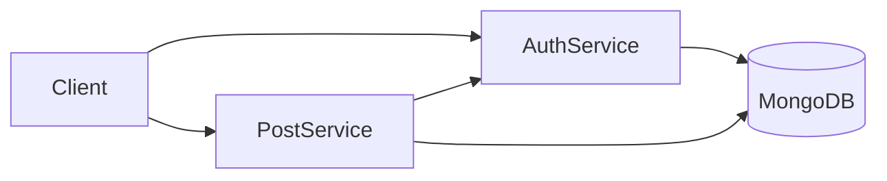

# 🚀 Distributed Microservices System

A robust microservices-based system built with Node.js, Prisma, and MongoDB, featuring authentication and post management services. This system demonstrates modern microservices architecture with inter-service communication.

## ✨ Features

- 🔐 **Authentication Service**
  - User registration and login
  - JWT-based authentication
  - Password encryption with bcrypt
  - User profile management

- 📝 **Post Service**
  - Create and retrieve posts
  - User association with posts
  - Inter-service communication
  - Efficient data fetching strategies

- 🛠️ **Technical Features**
  - MongoDB with Prisma ORM
  - Microservices Architecture
  - JWT Authentication
  - RESTful APIs
  - Service Discovery
  - Cross-service Data Aggregation

## 🚀 Getting Started

### Prerequisites
- Node.js (v14 or higher)
- MongoDB
- npm or yarn
- Postman (for testing APIs)

### Installation

1. Clone the repository:
```bash
git clone https://github.com/mohd-afnan-shahab/Distributed-Microservices-System.git
cd Distributed-Microservices-System
```

2. Install dependencies for both services:
```bash
# Auth Service
cd auth_micro
npm install

# Post Service
cd ../post_micro
npm install
```

3. Set up environment variables:
```bash
# For auth_micro/.env
DATABASE_URL="your_mongodb_url"
JWT_SECRET="your_jwt_secret"
PORT=3000

# For post_micro/.env
DATABASE_URL="your_mongodb_url"
JWT_SECRET="your_jwt_secret"
PORT=3001
AUTH_MICRO_URL="http://localhost:3000"
```

4. Run Prisma migrations:
```bash
# In each service directory
npx prisma generate
npx prisma db push
```

5. Start the services:
```bash
# Run each in separate terminals
npm run dev
```

## 🔧 API Endpoints

### Auth Service
```
POST /api/register - Register new user
POST /api/login - User login
GET /api/user - Get current user
GET /api/getUser/:id - Get user by ID
POST /api/getUsers - Get multiple users
```

### Post Service
```
GET /api/posts - Get all posts with user details
POST /api/posts - Create new post
```

## 🏗️ Architecture



## 💡 Implementation Details

### Authentication Flow
1. User registers/logs in through Auth Service
2. JWT token is generated and returned
3. Token is used for subsequent requests

### Post Creation Flow
1. Authenticated request to Post Service
2. Post created with user association
3. User details fetched from Auth Service

### Data Aggregation Strategies
The project implements three methods for data aggregation:
1. Individual user fetching
2. Batch user fetching
3. Optimized lookup with caching

## 🛠️ Built With
- **Node.js** - Runtime environment
- **Express** - Web
- Prisma - ORM
- MongoDB - Database
- JWT - Authentication
- bcrypt - Password hashing
- Axios - HTTP client

## 📈 Performance Optimizations
- Batch processing for user data
- Efficient data caching
- Optimized database queries
- Connection pooling

Built with ❤️ by Mohd Afnan Shahab
